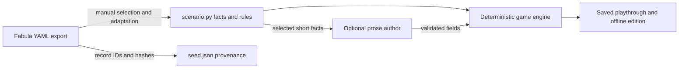

# Story terminal prototype

Built 2026-09-05–06 for T-037; extended on 6 September in T-038. This is a local, playable investigation,
not a deployed public chatbot or a general adventure generator.

T-040 has been reopened after review. The [revised adapter proposal](GRAPH_TO_GAME_ADAPTER.md)
is conditional on an [authored paper playtest](DRACULA_PAPER_PLAYTEST.md), source
verification and a product decision about agency/dialogue. The previous observer-only
direction was not approved. This runbook describes the experimental running game;
no runtime changes follow from the design revision. Its `current_run()` returns
404 on revision mismatch: playable old-version dispatch/migration is not implemented.

## Update 2026-10-08: projected worlds

The engine now also runs worlds projected straight from the narrative graph with
no hand authoring; see [the Wolf Hall projection results](WOLF_HALL_PROJECTION.md).
Dracula's routes, session key and saves are unchanged. Projected worlds are
registered in `settings.ADVENTURE_WORLDS` and served at `/play/<slug>/`.

## Play

- Page: `http://127.0.0.1:8766/play/dracula/`
- Embeddable component: `http://127.0.0.1:8766/play/dracula/embed/`
- Standalone example: [downloaded written world](prototypes/fabula-dracula-written-world.html).

The terminal begins in Jonathan Harker's convent room. Suggested commands
provide a route through the investigation. `help`, `map` and `journal` are
always available. For a complete walkthrough:

```text
tell agatha about mina
remember the castle
examine mirror
return to agatha
ask agatha about blood
```

To test progressive authoring, try `examine window`, then `study window`.
Leave and return, or reload: the accepted description remains the same.
Other unfinished details are Agatha's bag in the convent, and the fireplace
and dresser in the castle memory. They become explicit game objects with
examine/study behaviours; generated prose cannot add arbitrary mechanics.

The bag now has playable contents. Try:

```text
read manuscript
inventory
close bag
read manuscript
open bag
return manuscript
ask agatha about manuscript
```

Reading takes an accessible manuscript for consultation. Holding it keeps it
accessible when the bag closes; returning it preserves the reading flag. A
manuscript left inside a closed bag cannot be read until the bag is opened.
`take stake` and `take hammer` receive explicit refusals. `read manuscript`
never substitutes the journal. `study bag more closely` is a known command.
Accepted unfamiliar LLM phrases are saved and reused, including when frozen.
Existing saves gain physical-state defaults without losing passages/discoveries.

See [Infocom design findings and boundaries](INFOCOM_DESIGN_NOTES.md).

Expand **The writing room** below the terminal:

- **Use live LLM author** selects OpenRouter for this save, when a key is
  configured. New descriptions and unfamiliar command interpretation incur
  model charges. The local author is the default and makes no model calls.
- **Freeze this world** stops both LLM parsing and new passage generation.
  The core investigation, written passages and known commands still work.
- **Download playable HTML** compiles the current written world into a
  self-contained file. It resumes from the exported position, supports a
  new investigation, and requires no network, backend or model.
- **Start again** resets investigation progress and transcript while
  retaining the written objects, learned command aliases, author choice and freeze setting. Physical possession and reading progress reset.

## Local setup

Using the existing `fabula_wagtail` conda environment:

```bash
export DJANGO_SETTINGS_MODULE=fabula_web.settings.dev
python manage.py migrate adventure
python manage.py runserver 127.0.0.1:8766 --noreload
```

`ADVENTURE_ENABLED` defaults to true in development and false in base /
production settings. `ADVENTURE_AUTHOR_BACKEND` defaults to `local`;
`openrouter` can be selected as the initial mode via environment settings.
`ADVENTURE_MODEL` defaults to the existing `CHAT_MODEL` setting. Keys use
the existing `OPENROUTER_API_KEY`; no secret is sent to the browser.

The running test server used per-IP limits of 120/minute and 1000/hour to
accommodate browser automation. Normal settings retain the existing chat
limits. Prototype turns reuse that limiter, so chat and adventure currently
share its per-IP allowance. This is a local testing choice, not a public
capacity or spend guarantee. Provider caps remain a public-launch requirement.

## What is implemented

- Two source-linked scene anchors; event progression is explicitly a memory
  transition, not an invented walkable route or global fictional clock.
- A deterministic investigation with three unique discoveries. Free text
  maps to a bounded action vocabulary; an optional model resolves novel
  phrasing only among currently permitted actions.
- Seven source-backed object slots. A local author selects prepared variants,
  or OpenRouter returns bounded description/detail fields, plus a read passage for the manuscript. Accepted objects
  and prose are stored per playthrough, with source and backend attribution.
- Persistent PostgreSQL playthroughs identified by a server-side Django
  session. Discoveries, current scene, author setting, passages and transcript
  survive reloads. Browser session-cookie loss starts a separate playthrough;
  account-based and cross-device saves are not implemented.
- Versioned turns, request deduplication and a five-minute per-run database
  lease. Slow model calls run outside DB locks; accepted state and transcript
  commit together. Concurrent actions cannot overwrite a newer save. A failed
  generation releases the lease without advancing the story.
- Model-free export: Python compiles the finite transition table using the
  same rules as the API. The browser executes these outputs rather than
  duplicating game rules. Exported play saves locally where browser file
  storage is available; otherwise it remains playable for that open session.
- An accessible HTML terminal, command history, contextual suggestions,
  explicit loading/errors, touch input and responsive layout. No model HTML
  is executed; narration uses text nodes and export data uses `json_script`.

## Source and interpretation boundary

`adventure/seed.json` pins the local Dracula S1E1 graph-export file and three
event records with hashes, IDs and field references. `scenario.py` is an
editorial adaptation of that slice. It deliberately leaves out retrospective
plot commentary and treats dialogue as paraphrase. It has not independently
verified the screenplay. It does not query the whole live catalog each turn.

All LLM prose is playthrough adaptation. Shape validation prevents a model
from defining exits, state changes or discoveries; it does not prove semantic
faithfulness. A first live smoke response embellished the window's physical
appearance, so the author prompt was tightened to avoid unsupported physical
properties. Semantic evaluation and editorial review remain launch work.

There are finitely many expansion slots, not arbitrary location generation.
The authored investigation and its resolution are editorial. Promotion of
generated passages into a shared published game is not implemented. Scene
creation, general inventory manipulation and richer character dialogue need their
own allowed effects and source rules before expanding this prototype.

## Current graph connection (clarified in T-039)

The running adventure is manually adapted from three events in
`fabula_export/dracula/events/dracula_s01e01.yaml`. The source file and selected
records are identified by hashes and UUIDs in `adventure/seed.json`. At runtime
that JSON is loaded for provenance/source notes; the game does not load or query
the YAML, Wagtail's narrative models, Neo4j, or the chat retrieval tools each turn.
The hashes identify the selected snapshot; they are not a runtime synchronization
or freshness check.

`scenario.py` contains hand-authored scene anchors, discoveries, short object
facts, and the allowed expansion slots. `author.py` sends the selected slot's
short facts (and read_facts where applicable) to the model. The LLM has neither
the whole episode nor an ability to fetch additional graph context. The game
engine implements memory travel, possession and clue prerequisites as editorial
rules. Playthrough state and written passages live in the adventure Django models;
they are not written back to Fabula's canonical graph.



A graph-to-game adapter is still needed to retrieve a bounded event slice, resolve
nested locations and time-specific participation/object records, and construct
validated playable definitions. Containment must not be mistaken for a walkable
exit; event order is not automatically a puzzle dependency; a mentioned character
is not always physically present. Generated adaptations should remain separate
from source canon and retain provenance. This is the next substantive graph
integration capability, not something the current prototype already supplies.

## T-039 memory-command correction

The manuscript invited recall of the castle bedroom, but only shorter command
aliases were guaranteed. Fuller phrasing fell through to optional model parsing.
Memory verbs and location phrases now form a shared deterministic vocabulary,
including `think about the castle bedroom` and `recall the castle bedroom`.
Compound location matching uses the longest name so Castle Dracula is not also
a character target. These commands work with the author disabled, frozen, or at
its call budget, and are included in newly downloaded editions. Existing saved
prose is retained.

Validation: **44 adventure tests pass**, including the exact reported phrases,
exhausted-budget/frozen cases, referent preservation and unsupported target
regressions. The Chrome script checks both phrases online and in the standalone
file, as well as its existing desktop/mobile, save/replay and investigation checks.

## Verification

```bash
DJANGO_SETTINGS_MODULE=fabula_web.settings.dev python manage.py test adventure chat --noinput
```

Browser test (temporary dependency; no repository npm dependency required):

```bash
npm install --prefix /tmp/fabula-story-browser playwright --no-audit --no-fund
NODE_PATH=/tmp/fabula-story-browser/node_modules node scripts/test_story_terminal.cjs
```

The browser script uses installed macOS Google Chrome and the development
server at port 8766. `STORY_TEST_BASE_URL` can select another port. It checks
desktop/mobile layout, save/resume, stable authored replay, freeze mode,
embedded session continuity, and a complete offline investigation with HTTP
requests intercepted and blocked. Screenshots and an exported example are
written under `docs/prototypes/`.

One live OpenRouter description/detail generation completed in 2.07 seconds
using the configured model on 2026-09-06. That is transport/shape verification,
not an answer-quality evaluation or a latency benchmark.

Initial T-037 verification: **73 tests passed** (30 adventure tests plus the existing
43 chat tests). Desktop, mobile, save/resume, exact passage replay, freeze,
embedding and offline completion passed in Chrome with no page errors.
An additional live browser smoke test generated a passage in 1.43 seconds,
reloaded the page and replayed its exact text with the model-call count
remaining at one; a frozen unknown command made no further model call.
Run that optional, billable test with:

```bash
NODE_PATH=/tmp/fabula-story-browser/node_modules node scripts/test_story_terminal_live.cjs
```

Screenshots: [desktop](prototypes/dracula-terminal-desktop.png),
[discovery](prototypes/dracula-terminal-discovery.png),
[mobile](prototypes/dracula-terminal-mobile.png).

## T-038 verification

**84 tests passed** (41 adventure, 43 existing chat). Regression coverage includes
manuscript/journal separation, unknown-target and verb substitution, containment,
possession, stable readable prose, legacy saves, alias reuse, and all 80 compiled
physical/discovery combinations. Chrome checks passed for desktop, mobile,
resume, embedding, frozen play and manuscript interactions in the standalone
file with HTTP requests blocked (zero calls).

The updated live smoke test passed with two calls: manuscript generation
(2.785 seconds for the measured turn), then interpretation of `peruse manuscript`.
Repeating the phrase, reloading and frozen replay added no further calls.
An earlier failed live check and observed prose embellishments are recorded in
[the design notes](INFOCOM_DESIGN_NOTES.md#where-the-author-boundary-remains).
These transport and persistence checks do not establish semantic faithfulness.

Screenshot: [manuscript interactions](prototypes/dracula-terminal-manuscript.png).

## Files

- `adventure/scenario.py`, `seed.json`: curated evidence and adaptation.
- `adventure/engine.py`: finite state transitions and offline compiler.
- `adventure/author.py`: optional model parser and bounded passage writer.
- `adventure/parser.py`, `props.py`: referent checks and physical interaction rules.
- `adventure/models.py`, `views.py`: persistent turns, concurrency and endpoints.
- `templates/adventure/`, `static/adventure/`: reusable terminal and standalone export.

The prototype is not enabled or deployed on fabula.productions. Existing
chat code and unrelated working-tree changes have been preserved.
